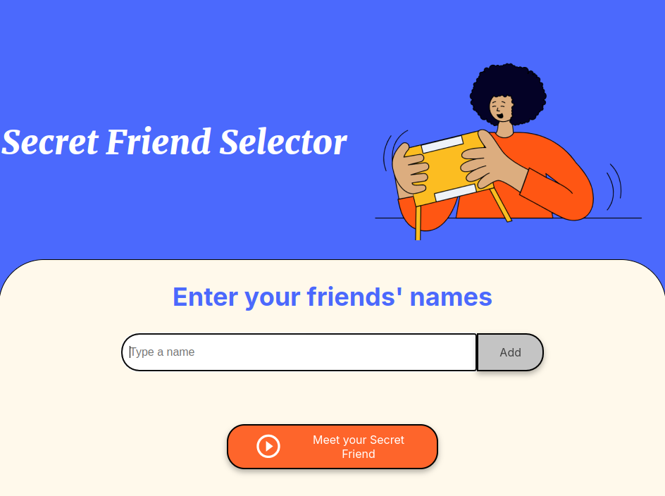

# Secret Friend 🎁

### Description 📜

This is an interactive web project to conduct "Secret Friend" draws quickly and easily. It allows users to add a list of friends and randomly select a participant.

### Features ✨

* Add friends: Enter names into the participant list.

* View list: Display added friends on the screen.

* Random draw: Select a random friend from the list.

* User-friendly interface: Clean and easy-to-use design.

### Screenshots 📸



### Installation 🚀

No installation required. Simply download or clone the repository and open the index.html file in your browser.
```bash
# Clone the repository
git clone https://github.com/yourusername/secret-friend.git
```

### Usage 🛠️

1. Open the index.html file in your browser.

2. Enter your friends' names and click "Add".

3. Once all friends are added, click "Draw friend".

4. The randomly selected secret friend will be displayed.

### Technologies Used 🖥️

* HTML → Page structure.

* CSS → Styling and responsive design.

* JavaScript → Draw logic and DOM manipulation.

### Contribution 🤝

If you want to improve this project, you are welcome!

1. Fork the repository.

2. Create a new branch: git checkout -b new-feature.

3. Commit your changes: git commit -m "Added new feature".

4. Push your changes: git push origin new-feature.

5. Open a Pull Request.

### Author ✍️

Tatiana Maldonado Perez - Web Developer 💻